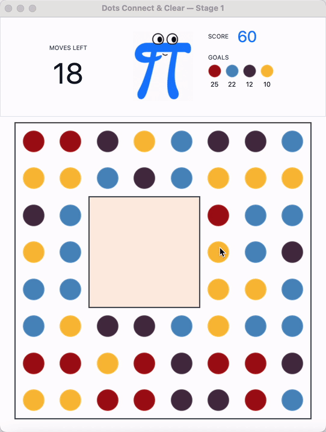
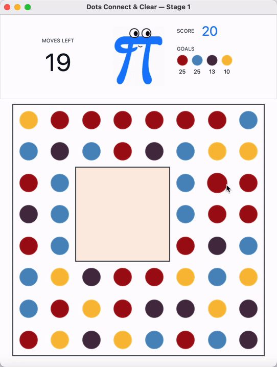

# Dots Connect & Clear

> **少儿编程趣味实践——消消乐游戏**
>
> 在连点消除游戏中，循序渐进地学习 Python、Tkinter 与面向对象编程。
>
> 本项目改编自澳大利亚昆士兰大学 2017 年本科编程实践项目。当前版本对原项目进行了适当简化，并提供完整的程序框架与丰富的支持代码，帮助初学者聚焦核心知识，轻松上手、逐步实践。

Dots Connect & Clear 游戏效果演示
<p align="center">
  
  &nbsp;&nbsp;&nbsp;&nbsp;
  &nbsp;&nbsp;&nbsp;&nbsp;
  
</p>


## 项目简介

Dots Connect & Clear 是一款受 *Dots & Co.* 启发的 Python 桌面小游戏，同时也是一个面向编程初学者的趣味实践项目。玩家需要连接相邻的同色圆点完成消除，并在有限步数内获得尽可能高的分数。

项目在完整游戏的基础上拆分了循序渐进的学习阶段，并提供可运行的代码框架，适合课堂演示、课后练习和面向对象编程教学。

本项目参考了 [昆士兰大学（UQ）CSSE1001/7030 2017 S2 Assignment 3](https://csse1001.github.io/records/2017s2/a3/index.html)。由于原始支持代码现已难以获取，本版本依据公开的任务说明与原有架构重新实现，并对界面、动画和玩法进行了适当调整。

## 游戏玩法

- 按住鼠标并拖动，连接水平或垂直方向上相邻的同色圆点。
- 一次至少连接两个圆点，松开鼠标即可完成消除。
- 圆点消除后，上方圆点会自动下落，并由新圆点补充棋盘。
- 在限定步数内规划连接路线，尝试获得更高分数。

## 项目特色

- 基于 Python 标准库 Tkinter 构建图形界面。
- 包含圆点消除、重力下落与棋盘补充动画。
- 通过分阶段设计逐步引入继承、多态、工厂模式和组合关系。
- 提供基础圆点、特殊圆点、伙伴系统及可配置的生成权重。
- 附带单元测试，便于验证实现并支持课堂练习。

## 版本说明

| 目录 | 内容 | 适合场景 |
| --- | --- | --- |
| `origin/` | 功能完整的游戏版本 | 直接体验完整游戏、参考最终实现 |
| `stage1/` | 基础游戏与预留扩展接口 | 学习 GUI、游戏流程与基础模型设计 |
| `stage1S/` | Stage 1 的另一套教学任务标记版本 | 按 `TODO-STAGE1-*` 提示组织练习 |
| `stage2/` | 特殊圆点、加权工厂与伙伴系统 | 学习继承、多态、工厂模式与组合关系 |

各阶段的具体教学目标和配置方式，请参阅对应目录中的 README；Stage 1 的练习要求见 `stage1/STAGE1_TASKS_ZH.md`。

## 快速开始

### 1. 准备环境

- Python 3
- Tkinter（通常随 Python 一同安装）
- Pillow 10.0 或更高版本

建议先创建并启用虚拟环境，然后在仓库根目录安装依赖：

```powershell
python -m venv .venv
.\.venv\Scripts\Activate.ps1
python -m pip install -r origin/requirements.txt
```

### 2. 启动游戏

运行完整版本：

```powershell
python origin/a3.py
```

也可以运行对应的教学阶段：

```powershell
python stage1/a3.py
python stage2/a3.py
```

## 运行测试

在仓库根目录执行：

```powershell
python -m unittest discover -s origin/tests -v
python -m unittest discover -s stage1/tests -v
python -m unittest discover -s stage2/tests -v
```

## 项目结构

```text
.
├── assets/     # 图片与动画资源
├── origin/     # 完整游戏版本
├── stage1/     # 第一阶段：基础游戏
├── stage1S/    # 第一阶段：教学任务标记版本
└── stage2/     # 第二阶段：特殊圆点与伙伴系统
```

## 许可证

本项目采用 [MIT License](LICENSE)。
