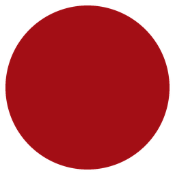
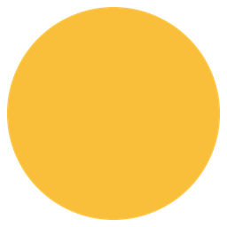

# Stage 2 任务书——特殊 Dot 与 Companion

## 1. Stage 2 简介

Stage 2 使用中文注释的 `config.py`。可以在该文件中选择 Dot 类型、
相对权重与 Companion；请只启用一个配置块。

Stage 1 的棋盘只有普通彩色 Dot。Stage 2 将加入两类扩展：

- **特殊 Dot**：位于棋盘中，通过不同的 `activate` 实现范围消除、改色或特殊连接；
- **Companion（伙伴）**：位于棋盘外，接收 `CompanionDot` 提供的充能，充满后在棋盘上制造特殊 Dot。

本阶段主要学习继承、多态和组合关系。棋盘、连接、计分、重力、补充、动画、图片绘制和充能进度条均为支持代码，不要求学生重新实现。

任务按以下顺序展开：

```text
入门示例一：FlowerDot
→ 入门示例二：CompanionDot + StarDot + StarCompanion
→ 中等任务：Beam、Swirl + EskimoCompanion
→ 高难度拓展：Wildcard、耐久障碍、Anchor
```

> 文档中的图片颜色只用于展示，同一种特殊 Dot 在游戏中可以拥有不同颜色。

## 2. 已提供的基础

### 2.1 Dot 的公共接口

<p align="center">
  
  &nbsp;&nbsp;
  
  &nbsp;&nbsp;
  
</p>

`AbstractDot` 和 `BasicDot` 已经提供。普通 Dot 激活后只影响自己：

```python
class AbstractDot(ABC):
    asset_family = "basic"
    asset_variant: Optional[str] = None
    connectable = True

    def __init__(self, kind: str) -> None:
        self.kind = kind

    def can_connect(self, other: "AbstractDot") -> bool:
        return self.connectable and other.connectable and self.kind == other.kind

    def activate(self, grid: Any, position: Position) -> Set[Position]:
        return {position}


class BasicDot(AbstractDot):
    pass
```

特殊 Dot 通常使用下面的模板：

```python
class MySpecialDot(AbstractDot):
    asset_family = "素材类别"

    def activate(self, grid: Any, position: Position) -> Set[Position]:
        return {position}
```

### 2.2 Dot 与 Companion 的关系

`CompanionDot` 是棋盘上的 Dot，`Companion` 是 `DotGame` 持有的棋盘外伙伴。它们不是父子类。

```text
玩家消除 CompanionDot
→ DotGame 统计数量
→ Companion 增加充能
→ 充满后 Companion 激活
→ 棋盘上产生新的特殊 Dot
```

伙伴的基础充能、事件通知和进度条已经提供。学生重点实现“伙伴充满后做什么”。

### 2.3 可以使用的接口

代码标记约定：`TODO X` 表示学生需要完成任务 X；`For X` 表示该代码已经实现，
用于支持任务 X，不需要学生补写。

```python
grid.rows
grid.columns
grid.neighbours(position)
grid.positions()
grid.dot_at(position)
grid.set_dot(position, dot)
grid.factory.create_dot()
grid.factory.create_dot(kind=kind, dot_type=BasicDot)
grid.factory.create_dot(kind=kind, dot_type=SwirlDot)
grid.factory.create_dot(kind=kind, dot_type=StarDot)
```

Factory 只提供一个 `create_dot` 创建入口。按权重选择类型和普通 Dot 构造已经
实现；Beam 与 Wildcard 的特殊分支分别标记为 `For 3.1` 和
`For Extension 4.1`。不需要为每种 Dot 新增 `create_xxx` 方法。

## 3. 入门示例一——FlowerDot

<p align="center">
  
</p>

Flower 激活后消除自己和上、下、左、右四个邻居，不影响斜对角位置。

### TODO 1.1——完成 FlowerDot

学生会得到以下框架：

```python
class FlowerDot(AbstractDot):
    """Remove itself and its orthogonal neighbours."""

    asset_family = "flower"

    def activate(self, grid: Any, position: Position) -> Set[Position]:
        # TODO 1.1
        # 使用 grid.neighbours(position) 取得有效邻居。
        # 返回包含自身和全部邻居的位置集合。
        pass
```

**检查标准：**

- 返回值是集合；
- 中央 Flower 影响 5 个位置；
- 角落 Flower 只影响 3 个位置；
- 不修改棋盘和结算支持代码。

这一任务只展示特殊 Dot，不需要 Companion。

## 4. 入门示例二——CompanionDot、StarDot 与 StarCompanion

<p align="center">
  
  &nbsp;&nbsp;&nbsp;&nbsp;
  <span>→ 充能 →</span>
  &nbsp;&nbsp;&nbsp;&nbsp;
  
</p>

这个组合用来理解 Dot 与 Companion 如何合作：

- `CompanionDot` 在棋盘上，可以像普通同色 Dot 一样连接；
- 它真正被消除后，为伙伴提供 1 点充能；
- `StarCompanion` 充满后，把一个存活 Dot 变成同色 `StarDot`；
- 玩家之后连接 Star，Star 会消除棋盘上全部同色 Dot。

本组合的普通补充只生成 `BasicDot` 和 `CompanionDot`。`StarDot` 不会随机出现，只能由 `StarCompanion` 产生，因此充能效果来源清晰。

### TODO 2.1——完成 CompanionDot

`CompanionDot` 不需要重写 `activate`，直接复用普通 Dot 的行为：

```python
class CompanionDot(BasicDot):
    # TODO 2.1：设置正确的素材类别
    asset_family = "..."
```

### TODO 2.2——完成 StarDot

Star 有自己的颜色，并像普通 Dot 一样参与同色连接：

```python
class StarDot(BasicDot):
    asset_family = "star"

    def activate(self, grid: Any, position: Position) -> Set[Position]:
        # TODO 2.2
        # 返回棋盘上全部同色 Dot 的位置集合。
        pass
```

可以使用 `grid.positions_of_kind(self.kind)`。

### TODO 2.3——完成 StarCompanion.activate

`AbstractCompanion` 的充能和清零逻辑已经提供。学生只完成 StarCompanion 充满后的效果：

```python
class StarCompanion(AbstractCompanion):
    def activate(self, grid: Any,
                 excluded: Iterable[Position] = ()) -> None:
        # TODO 2.3
        # 1. 找出没有在 excluded 中的存活、可连接 Dot。
        # 2. 随机选择一个位置。
        # 3. 使用 grid.factory.create_dot 创建同色 StarDot。
        pass
```

`excluded` 是本回合即将消除的位置，伙伴不能选择这些位置。
候选位置筛选使用 `available_positions`，学生重点实现选取和替换。

**检查标准：**

- 普通 Dot 不会提供伙伴充能；
- 每个实际消除的 `CompanionDot` 提供 1 点充能；
- 未充满时棋盘不发生伙伴变化；
- Star 不会由普通棋盘补充随机生成；
- 充满后生成一个与原位置颜色相同的 `StarDot`；
- 连接 Star 后，棋盘上全部同色 Dot 被消除；
- 伙伴不会修改本回合即将消除的 Dot。

## 5. 中等任务——更多 Dot 与 Companion 组合

这一部分不再提供完整类框架，学生根据效果说明独立写出类代码。

### TODO 3.1——单一 BeamDot 与方向

<p align="center">
  
  &nbsp;&nbsp;&nbsp;
  
  &nbsp;&nbsp;&nbsp;
  
</p>

只实现一个 `BeamDot` 类，方向作为对象状态由外部传入：

- `asset_family = "beam"`；
- 构造函数接收 `kind` 和 `direction`；
- `direction` 只允许 `"horizontal"`、`"vertical"` 或 `"cross"`；
- 非法方向应抛出 `ValueError`；
- 通过只读属性 `asset_variant` 返回方向；
- 水平方向返回所在整行，垂直方向返回所在整列，交叉方向返回两者并集。

`BeamDot` 本身不随机选择方向。随机补充由 `DotFactory.create_dot` 使用
Factory 的 RNG 选择方向；需要明确方向的调用者可以直接传入。这样 Beam 对象
保持确定性，相同随机种子的 Factory 也能生成可重复的结果。

Factory 中的 Beam 分支标记为 `For 3.1`；学生只实现 `TODO 3.1` 标记的
`BeamDot` 方向保存、校验与激活范围。

**检查标准：** 在 8×8 棋盘中，水平和垂直 Beam 各影响 8 个位置，Cross Beam 影响 15 个不同位置。

### TODO 3.2——SwirlDot

<p align="center">
  
</p>

`SwirlDot` 激活时：

1. 查看周围八格，包括斜对角；
2. 跳过自身、空格和不可连接障碍；
3. 将有效邻居替换成与 Swirl 同色的 `BasicDot`；
4. 只返回 Swirl 自身的位置。

**检查标准：** 只修改周围有效 Dot，最终只消除 Swirl 自己。

### TODO 3.3——EskimoCompanion

<p align="center">
  
  &nbsp;&nbsp;&nbsp;&nbsp;
  <span>→ 充能 →</span>
  &nbsp;&nbsp;&nbsp;&nbsp;
  
</p>

实现 `EskimoCompanion.activate`：

- 使用 `available_positions` 取得候选位置；
- 随机选择最多 `swirl_count` 个位置；
- 将它们分别替换成与原 Dot 同色的 `SwirlDot`；
- 候选数量不足时，只转换现有候选，不产生错误。

这个组合展示同一个 `CompanionDot` 可以给不同伙伴充能，而不同伙伴可以产生不同特殊 Dot。

### TODO 3.4——BuffaloCompanion

实现 `BuffaloCompanion.activate`：

- 使用 `available_positions` 取得候选位置；
- 随机选择最多 `wildcard_count` 个位置；
- 使用 `grid.factory.create_dot(dot_type=WildcardDot)` 将它们替换成 `WildcardDot`；
- 候选数量不足时只转换现有候选，不产生错误。

`WildcardDot` 没有固定颜色，因此不需要保留被替换 Dot 的颜色。本回合即将消除的
位置必须保持在 `excluded` 中，不能被 Companion 选中。

### TODO 3.5——CaptainCompanion

实现 `CaptainCompanion.activate`：

- 使用 `available_positions` 取得候选位置；
- 随机选择最多 `beam_count` 个位置；
- 为每个位置随机选择 `"horizontal"`、`"vertical"` 或 `"cross"`；
- 使用统一的 `grid.factory.create_dot`，传入 `BeamDot`、颜色和方向；
- 候选数量不足时只转换现有候选，不产生错误。

Buffalo 与 Captain 都只替换仍在棋盘上的 Dot，不直接删除位置，也不修改动画、
计分、重力或统一结算流程。

## 6. 高难度拓展

### Extension 4.1——WildcardDot

<p align="center">
  
</p>

Wildcard 没有固定颜色，可以与任意可连接 Dot 相连。创建 `WildcardDot`，使用 `"wildcard"` 作为默认 `kind`，并重写 `can_connect(other)`。

连接路径确定颜色、回退和成环规则由支持代码完成。

### Extension 4.2——ShellDot 与 TurtleDot

<p align="center">
  
  &nbsp;&nbsp;&nbsp;&nbsp;
  
</p>

Turtle 是不可直接连接的两阶段耐久障碍：第一次受到 Flower 或 Beam 等范围效果时躲进壳里，图片由 Turtle 变为 Shell；第二次命中时消失。`ShellDot` 表示一个初始时已经躲进壳里的 Turtle，因此只需再命中一次。

先实现共同父类 `DurableDot`：

- `connectable = False`；
- 最大耐久为 2；
- 构造时保存剩余耐久；
- `take_hit()` 将耐久减 1，并返回是否应当移除。

然后实现 `TurtleDot`：根据剩余耐久动态返回 `"turtle"` 或 `"shell"` 素材类别。最后让 `ShellDot` 继承 `TurtleDot`，但从 1 点剩余耐久开始。

**检查标准：** Turtle 第一次命中后仍是同一个对象，但显示 Shell 图片；第二次命中后消失；直接生成的 Shell 一次命中后消失。本阶段不实现 Turtle 的随机移动。

### Extension 4.3——AnchorDot

<p align="center">
  
</p>

Anchor 不可直接连接，会随重力下降，到达所在列最低可用位置后自动收集。学生只需实现 `AnchorDot` 的素材类别与不可连接属性，重力和收集由支持代码完成。

## 7. 推荐测试组合

一次只启用两到三种 Dot，便于观察效果。

| 学习内容 | Dot 组合 | Companion |
| --- | --- | --- |
| Flower 入门 | Basic + Flower | 无 |
| Companion 入门 | Basic + CompanionDot | Star |
| Beam | Basic + BeamDot（随机方向） | 无 |
| Swirl 与伙伴 | Basic + CompanionDot | Eskimo |
| Wildcard 与伙伴 | Basic + CompanionDot | Buffalo |
| Beam 与伙伴 | Basic + CompanionDot | Captain |
| Turtle 状态变化 | Basic + Flower + Turtle | 无 |
| Anchor | Basic + Horizontal + Anchor | 无 |

## 8. 完成检查清单

- 能解释 `CompanionDot` 与 `Companion` 不是同一个对象；
- `FlowerDot` 能正确影响正交邻居；
- Companion 只从实际消除的 `CompanionDot` 获得充能；
- StarCompanion 生成 Star，Eskimo 生成 Swirl；
- BuffaloCompanion 生成 Wildcard，CaptainCompanion 生成随机方向的 Beam；
- 单一 BeamDot 的三种方向效果正确，且 BeamDot 内部不产生随机方向；
- `SwirlDot` 正确修改周围 Dot；
- Turtle 第一次命中切换为 Shell 外观，第二次命中后消失；
- 没有把动画、重力、计分或充能进度条复制到学生类中；
- 教师要求的拓展功能通过测试。

## 9. 运行与验证

在 `config.py` 中只保留一个配置块处于启用状态。
学生可以直接修改 Dot 类型和相对权重，例如：

```python
ENABLED_DOT_TYPES = [
    (BasicDot, 76),
    (FlowerDot, 12),
    (TurtleDot, 8),
    (ShellDot, 4),
]
COMPANION_TYPE = None
```

```powershell
python -m unittest discover -s stage2/tests -v
python stage2/a3.py
```

自动测试通过后，还应在界面中观察图片、连接、伙伴充能和特殊效果。
