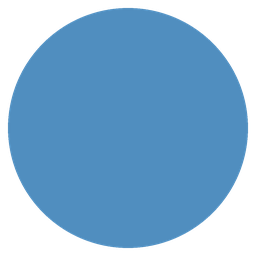
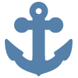

# Stage 2 任务书——用 Class 构建 Dot 与 Companion

## 1. 学习目标与任务顺序

Stage 2 不要求学生修改 GUI、动画、重力、计分或 Factory。学生在小型 class
和方法中实现核心算法，并观察不同对象如何合作产生完整游戏能力。

本阶段先学习一个独立的特殊 Dot，再建立所有 Companion 共用的充能基础。
之后，每个 Companion 都紧挨它所创建的 Dot，作为一组完成：

```text
TODO 1.1  FlowerDot：特殊 Dot 入门

TODO 2.1  统计 CompanionDot
TODO 2.2  AbstractCompanion.add_charge
TODO 2.3  StarDot
TODO 2.4  StarCompanion
            ↓ 完成第一组充能能力并运行

TODO 3.1  SwirlDot
TODO 3.2  EskimoCompanion
            ↓ 完成第二组能力并运行

TODO 4.1  BeamDot
TODO 4.2  CaptainCompanion
            ↓ 完成第三组能力并运行

TODO 5.1  TurtleDot
Extension 5.2  AnchorDot
```

顺序原则：

- Companion 的统计和充能基础位于所有具体 Companion 及其关联 Dot 之前；
- 每组先实现 Dot 自己的效果，再实现创建它的 Companion；
- 后面的 TODO 可以依赖前面的 TODO，前面的 TODO 不依赖后面的 TODO；
- 2.1–2.4 是一个完整教学组，中间任务用独立测试验证，完成 2.4 后再运行 GUI；
- 3.1–3.2 和 4.1–4.2 同样以“完成一组、运行一次”为检查点。

代码标记：

- `TODO X`：学生需要完成；
- `For X`：已经实现、用于支持任务 X；
- 没有标记：游戏原有支持代码。

## 2. 已提供的基础

### 2.1 先认识游戏里的对象

先不要急着读代码。可以把每个 Dot class 想成一种“棋子设计图”：设计图说明
这种棋子有什么颜色、能不能连接、使用哪张图片，以及激活时会发生什么。
游戏棋盘中真正出现的每一颗棋子，才是根据设计图创建出来的对象。

<table>
  <tr>
    <td align="center" width="90"></td>
    <td><strong><code>BasicDot</code></strong><br>普通彩色 Dot。只能与相同颜色连接，激活时只移除自己。</td>
  </tr>
  <tr>
    <td align="center"></td>
    <td><strong><code>FlowerDot</code></strong><br>花朵 Dot。激活后影响自己和上、下、左、右四格。</td>
  </tr>
  <tr>
    <td align="center"></td>
    <td><strong><code>CompanionDot</code></strong><br>伙伴充能 Dot。它真正被移除时，为当前 Companion 增加一点 charge。</td>
  </tr>
  <tr>
    <td align="center"></td>
    <td><strong><code>StarDot</code></strong><br>星星 Dot。激活后找出并移除棋盘上所有同色 Dot。</td>
  </tr>
  <tr>
    <td align="center"></td>
    <td><strong><code>SwirlDot</code></strong><br>漩涡 Dot。把周围八格改成自己的颜色，但保留它们原来的 class。</td>
  </tr>
  <tr>
    <td align="center">
      
      
      
    </td>
    <td><strong><code>BeamDot</code></strong><br>光束 Dot。同一个 class 根据 direction 影响整行、整列或十字。</td>
  </tr>
  <tr>
    <td align="center"></td>
    <td><strong><code>TurtleDot</code> / <code>ShellDot</code></strong><br>有耐久的障碍。第一次命中变成龟壳，第二次命中才消失。</td>
  </tr>
  <tr>
    <td align="center"></td>
    <td><strong><code>AnchorDot</code></strong><br>随重力下降的目标。到达所在列底部后被收集。</td>
  </tr>
  <tr>
    <td align="center"></td>
    <td><strong><code>WildcardDot</code></strong><br>完整的 For Extension 示例，可以连接任意颜色。</td>
  </tr>
</table>

### 2.2 所有 Dot 都会提供什么

所有 Dot 都继承 `AbstractDot`，所以游戏可以用相同方式询问不同对象：

| 名称 | 可以把它理解成 | 小例子 |
| --- | --- | --- |
| `kind` | Dot 当前的颜色 | `dot.kind == "blue"` |
| `connectable` | 玩家能否拖线连接它 | Turtle 和 Anchor 为 `False` |
| `asset_family` | 图片所在的素材类别 | Flower 使用 `"flower"` |
| `asset_variant` | 同一类别中的图片变化 | Beam 使用 `"horizontal"` |
| `activate(grid, position)` | 这个 Dot 被激活时负责做什么 | Flower 返回自己和四个邻居 |

这里最重要的是 `activate`。Game 不需要写一大串“如果是 Flower……如果是
Star……”的判断，只需要调用当前对象自己的方法：

```python
affected_positions = dot.activate(grid, position)
```

同一句代码遇到不同 class 会得到不同结果，这就是本阶段要体验的多态。通常
`activate` 返回一个位置 set，表示本次效果最终想影响哪些格子；Swirl 比较特殊，
它还会直接修改周围对象的颜色。

### 2.3 怎样看懂棋盘坐标

棋盘位置使用 `(row, column)`：先写第几行，再写第几列，而且从 0 开始。

```text
             column
             0       1       2
row 0      (0, 0)  (0, 1)  (0, 2)
row 1      (1, 0)  (1, 1)  (1, 2)
row 2      (2, 0)  (2, 1)  (2, 2)
```

如果 Flower 位于 `(1, 1)`，它的上方是 `(0, 1)`，下方是 `(2, 1)`，左边是
`(1, 0)`，右边是 `(1, 2)`。如果它位于 `(0, 0)`，再向上或向左就会走出棋盘，
因此必须先做边界判断。

### 2.4 常用的 grid 方法

| 方法 | 作用 | 示例结果 |
| --- | --- | --- |
| `grid.rows` | 棋盘共有多少行 | 8 行棋盘得到 `8` |
| `grid.columns` | 棋盘共有多少列 | 8 列棋盘得到 `8` |
| `grid.in_bounds(position)` | 判断坐标是否在棋盘内 | `(0, 0)` 为 True，`(-1, 0)` 为 False |
| `grid.positions()` | 依次给出棋盘中的所有坐标 | 可用于遍历整张棋盘 |
| `grid.dot_at(position)` | 查看某格当前是什么对象 | 可能得到一个 Dot，也可能得到 `None` |
| `grid.set_dot(position, dot)` | 把某个对象放入指定格子 | Companion 用它替换 Dot |
| `grid.is_blocked(position)` | 判断该格是不是中央障碍 | Anchor 判断下方是否还有可玩格 |

一个常见的“遍历并筛选”结构如下：

```python
matching = []
for position in grid.positions():
    dot = grid.dot_at(position)
    if dot is not None and dot.connectable:
        matching.append(position)
```

先取得位置，再取得对象，最后判断它是否符合条件。后面的 Star 和所有具体
Companion 都会重复使用这个思路。

### 2.5 Factory 为什么已经提供

Factory 可以理解成统一的“Dot 制作机”。它负责选择正确的 class、颜色和特殊
参数，学生不需要重复学习每一种构造方式：

```python
star = grid.factory.create_dot(kind="blue", dot_type=StarDot)
swirl = grid.factory.create_dot(kind="gold", dot_type=SwirlDot)
beam = grid.factory.create_dot(
    kind="purple",
    dot_type=BeamDot,
    direction="cross",
)
```

- `kind` 决定颜色；
- `dot_type` 决定创建哪个 class；
- `direction` 只在创建 Beam 时使用；
- 创建完成后仍需用 `grid.set_dot(position, new_dot)` 把新对象放回棋盘。

Factory 属于 `For` 支持代码。本阶段的重点是“什么时候创建什么对象”，不是
Factory 内部怎样做加权随机。

### 2.6 Companion 与 CompanionDot 不是同一个对象

<table>
  <tr>
    <td align="center" width="90"></td>
    <td><strong><code>CompanionDot</code></strong><br>出现在棋盘上的 Dot；被真正移除时提供 charge。</td>
  </tr>
  <tr>
    <td align="center">⚡</td>
    <td><strong><code>AbstractCompanion</code></strong><br>棋盘外持续存在的能力对象；保存 charge，充满后调用具体 Companion 的 <code>activate</code>。</td>
  </tr>
</table>

例如 charge 上限为 3：第一次移除 CompanionDot 后 charge 为 1，第二次为 2，
第三次达到上限后清零并激活一次。StarCompanion、EskimoCompanion 和
CaptainCompanion 共用同一套充能规则，只是充满后创建的 Dot 不同。

## 3. 第一阶段——特殊 Dot 入门

### TODO 1.1——FlowerDot

<table>
  <tr>
    <td align="center" width="90"></td>
    <td><strong><code>FlowerDot</code></strong><br>第一份示例：用一个小循环计算四方向坐标，并练习棋盘边界判断。</td>
  </tr>
</table>

Flower 消除自己以及上、下、左、右四个位置，不影响斜对角。

在 `FlowerDot.activate` 中：

1. 拆分 `row` 和 `column`；
2. 建立四个方向变化量；
3. 用循环计算邻居位置；
4. 用 `grid.in_bounds` 跳过棋盘外位置；
5. 返回包含自身和有效邻居的 set。

不要调用 `grid.neighbours`，因为坐标计算和边界判断就是本任务的核心。
当前默认 config 可以直接观察 Flower：中央位置影响 5 格，角落影响 3 格。

可以先在纸上模拟 `(1, 1)`：

```text
               (0, 1)
                  ↑
        (1, 0) ← (1, 1) → (1, 2)
                  ↓
               (2, 1)
```

推荐按下面的思路实现：

1. `affected` 一开始只放 Flower 自己，确保它一定会被移除；
2. `directions` 保存四个“小移动”，例如 `(-1, 0)` 表示向上一行；
3. 循环中把小移动加到当前坐标，得到一个候选邻居；
4. 候选仍在棋盘内，才把它加入 `affected`；
5. 循环结束后统一返回结果。

自查问题：为什么这里使用 set 而不是 list？因为效果只关心“哪些位置被影响”，
同一个位置不应该重复出现。

## 4. 第二阶段——Companion 基础与 Star 第一组能力

这一组先建立所有 Companion 共用的工作流程，再完成第一种具体能力：

```text
移除 CompanionDot → 统计数量 → 增加 charge
→ 充满并清零 → StarCompanion 创建 StarDot → StarDot 同色全消
```

### TODO 2.1——统计最终移除的 CompanionDot

<table>
  <tr>
    <td align="center" width="90"></td>
    <td><strong><code>CompanionDot</code></strong><br>先认出最终移除对象的 class，再决定本回合应该增加多少 charge。</td>
  </tr>
</table>

`CompanionDot` 的 class 和素材是 `For 2.1`。在
`DotGame.count_companion_dots(positions)` 中：

1. 只遍历最终移除位置；
2. 取得每个位置的 Dot；
3. 使用 `isinstance(dot, CompanionDot)` 判断类型；
4. 累加并返回数量。

被 Flower 等范围效果间接移除的 CompanionDot 也必须计数；最终移除集合以外
的对象不能计数。完成后运行该方法的独立测试。

### TODO 2.2——AbstractCompanion.add_charge

<table>
  <tr>
    <td align="center" width="180"></td>
    <td><strong><code>AbstractCompanion</code></strong><br>把本回合获得的点数存进 charge；到达上限时清零并触发一次能力。</td>
  </tr>
</table>

实现所有 Companion 共用的状态逻辑：

1. 根据 `amount` 逐点增加 `self.charge`；
2. 每次达到 `charge_limit` 时清零；
3. 调用子类的 `activate(grid, excluded)`；
4. 统计并返回本次激活次数。

事件通知和进度条更新是 `For`。本任务使用测试替身验证累加、触发、清零和
多次触发，不需要调用尚未完成的 StarCompanion。

### TODO 2.3——StarDot

<table>
  <tr>
    <td align="center" width="90"></td>
    <td><strong><code>StarDot</code></strong><br>遍历整张棋盘，找出所有与自己颜色相同的对象。</td>
  </tr>
</table>

Star 被连接后，消除棋盘上全部与自己同色的 Dot。在 `StarDot.activate` 中：

1. 遍历 `grid.positions()`；
2. 取得每个位置的 Dot；
3. 跳过空格；
4. 比较 `dot.kind` 与 `self.kind`；
5. 收集并返回全部匹配位置。

不要调用 `positions_of_kind`，因为遍历和筛选是本任务的核心。完成后先运行
StarDot 的小测试；Star 在本组中由下一任务的 StarCompanion 创建。

### TODO 2.4——StarCompanion.activate

<table>
  <tr>
    <td align="center" width="150"> ➜ </td>
    <td><strong><code>StarCompanion</code></strong><br>充满后选择一个存活 Dot，保留它的颜色并将它替换成 StarDot。</td>
  </tr>
</table>

实现第一种具体 Companion：

1. 遍历棋盘并排除本回合即将删除的位置；
2. 收集存活且可连接的 Dot；
3. 没有候选时安全结束；
4. 随机选择一个候选位置；
5. 保留原 Dot 的颜色；
6. 通过 Factory 创建同色 `StarDot` 并替换原位置。

完成后启用 config 的“TODO 2.1–2.4”配置，观察本组的完整充能链。StarDot
不会随机补充，只会由 StarCompanion 创建，因此来源清楚。

## 5. 第三阶段——Swirl 与 Eskimo 第二组能力

### TODO 3.1——SwirlDot

<table>
  <tr>
    <td align="center" width="90"></td>
    <td><strong><code>SwirlDot</code></strong><br>用双层循环访问周围八格，只改变对象颜色，不改变对象 class。</td>
  </tr>
</table>

Swirl 激活后，将周围八格的可连接 Dot 改成自己的颜色，只移除自身：

1. 用两个循环遍历 `-1、0、1` 的行列变化；
2. 跳过 `(0, 0)`、越界位置、空格和不可连接对象；
3. 修改邻居 Dot 的 `kind`；
4. 返回只包含 Swirl 自身的位置集合。

只改变颜色，不替换 class。例如 StarDot 改色后仍然是 StarDot。完成后运行
SwirlDot 的独立测试。

### TODO 3.2——EskimoCompanion.activate

<table>
  <tr>
    <td align="center" width="150"> ➜ </td>
    <td><strong><code>EskimoCompanion</code></strong><br>充满后随机选择多个位置，创建与原对象同色的 SwirlDot。</td>
  </tr>
</table>

根据 StarCompanion 的经验独立实现第二个子类：

- 收集未被排除的存活、可连接 Dot；
- 随机选择最多 `swirl_count` 个位置；
- 候选不足时只选择已有候选；
- 保留原颜色并通过 Factory 创建 `SwirlDot`。

完成后启用“TODO 3.1–3.2”配置。Swirl 只由 EskimoCompanion 创建。

## 6. 第四阶段——Beam 与 Captain 第三组能力

### TODO 4.1——BeamDot

<table>
  <tr>
    <td align="center" width="150"></td>
    <td><strong><code>BeamDot</code></strong><br>同一个 class 保存不同 direction，并据此计算整行、整列或十字。</td>
  </tr>
</table>

完成一个完整但简单的 `BeamDot` class：

- 保存 `kind` 和 `direction`；
- 合法方向为 `horizontal`、`vertical`、`cross`；
- 非法方向抛出 `ValueError`；
- `asset_variant` 等于方向；
- horizontal 返回整行，vertical 返回整列，cross 返回两者并集；
- 使用普通循环收集位置。

Beam 内部不随机。Factory 的 `For 4.1` 代码负责在未指定方向时随机选择。
完成后先运行 BeamDot 的方向测试。

### TODO 4.2——CaptainCompanion.activate

<table>
  <tr>
    <td align="center" width="150"> ➜ </td>
    <td><strong><code>CaptainCompanion</code></strong><br>充满后同时选择位置和方向，创建多个同色 BeamDot。</td>
  </tr>
</table>

Captain 综合使用前面的 Companion 和 Beam 知识：

1. 收集未被排除的候选 Dot；
2. 随机选择最多 `beam_count` 个位置；
3. 为每个位置随机选择一个合法方向；
4. 保留原颜色；
5. 通过 Factory 创建 `BeamDot`。

完成后启用“TODO 4.1–4.2”配置。Beam 只由 CaptainCompanion 创建。

## 7. 第五阶段——状态与生命周期拓展

### TODO 5.1——TurtleDot.take_hit

<table>
  <tr>
    <td align="center" width="150"> ➜ </td>
    <td><strong><code>TurtleDot</code></strong><br>连续两次命中展示对象状态如何跨回合保存和改变。</td>
  </tr>
</table>

Turtle 不可直接连接，并拥有两点耐久：

- 创建时显示 `turtle`；
- 第一次范围命中后改为 `shell`，返回 `False`；
- 第二次命中后返回 `True`，通知 Game 删除它。

学生在一个 class 内完成构造和 `take_hit`，不需要 property 或多层耐久父类。
`ShellDot` 是 `For 5.1` 示例。启用对应 config，用已经完成的 Flower 连续命中。

### Extension 5.2——AnchorDot.has_landed

<table>
  <tr>
    <td align="center" width="90"></td>
    <td><strong><code>AnchorDot</code></strong><br>对象自己判断是否已经到达所在列最下面的可玩位置。</td>
  </tr>
</table>

Anchor 不可连接，会随重力下降。它从当前位置下一行开始扫描：下方还存在可玩
位置则返回 `False`，否则返回 `True`。Game 在重力完成后根据结果收集 Anchor。

## 8. For Extension 示例

`WildcardDot` 与 `BuffaloCompanion` 是完整 `For` 示例，不是学生 TODO。
它们展示第四种“关联 Dot + Companion”组合，可用于比较和自主拓展。

## 9. 运行与验收

每完成一个独立任务先运行测试；完成一个能力组后，再启用 config 中对应配置
启动 GUI：

```powershell
python -m unittest discover -s stage2/tests -v
python stage2/a3.py
```

检查：

- 35 个模型测试全部通过；
- 每个能力组能独立运行，不依赖后面的未完成 TODO；
- 特殊 Dot 由对应 Companion 创建，不在该组配置中随机生成；
- 学生能说明每个 class 负责创建对象、改变状态，还是计算移除位置。
